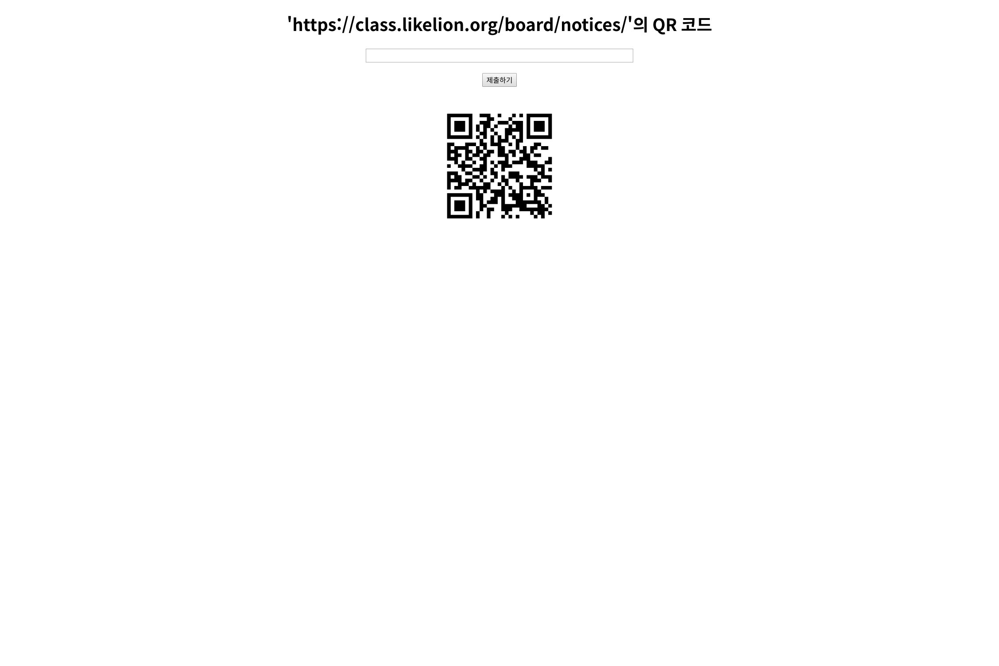

# Simple QR Code
원래 열심히 만든 프로젝트가 있는데 라이브러리를 이것 저것 설치했더니 용량이 1GB가 넘어가서 헤로쿠나 PythonAnywhere에 Deploy하지는 못하고, 멋사 과제는 제출을 해야겠고 해서 30분만에 만든 간단한 QR Code 프로젝트인데, 퀄리티는 그렇게 좋진 않지만 간단하게 쓸만한 수준은 되는 것 같은 서비스.

원래 진짜 개발자는 프론트 엔드에 집착하지 않는 법입니다.

## 설명
사용 방법이나 개념은 그냥 쓰면 딱 알 수 있습니다.

## 스크린샷

첫 번쨰 이미지

두 번쨰 이미지

세 번쨰 이미지